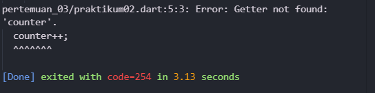
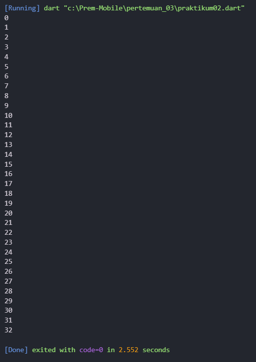
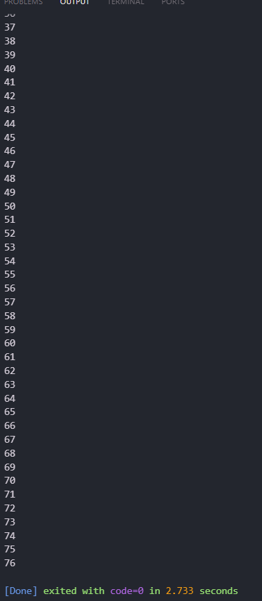
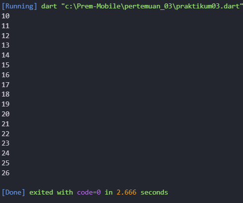
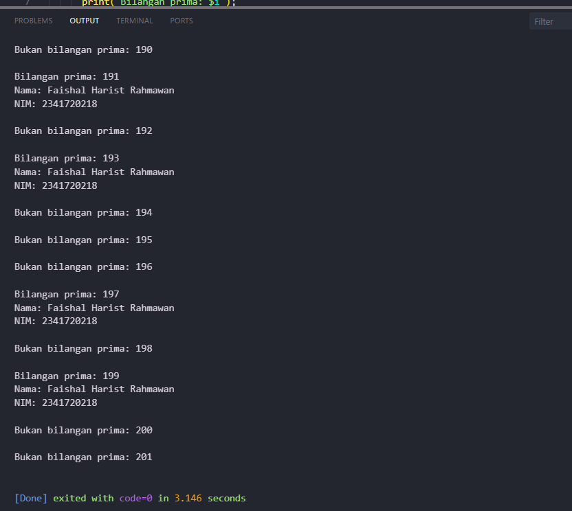

# **Laporan Praktikum Week 3**

**Identitas Mahasiswa:**

| Nama | Kelas | Absen |
|------|-------|-------|
| Faishal Harist Rahawan | TI-3H | 10 |

---

## **Praktikum 1: Menerapkan Control Flows ("if/else")**

### **Langkah 1**
**Kode Program:**
~~~dart
void main(List<String> args) {
  String test = "test2";
  if (test == "test1") {
    print("Test1");
  } else if (test == "test2") {
    print("Test2");
  } else {
    print("Something else");
  }

  if (test == "test2") {
    print("Test2 again");
  }
}
~~~

### **Langkah 2**
**Output dari Langkah 1:**  

**Penjelasan:**  
Output print test bernilai "test2". Karena kondisi else if pertama dan kondisi if kedua keduanya bernilai benar. Akibatnya, program akan menjalankan kedua perintah print dan menghasilkan output "Test2" diikuti "Test2 again".

### **Langkah 3**
**Kode sebelum dibenahi:**
~~~dart
String test = "true";
if (test) {
   print("Kebenaran");
}
~~~

**Kode yang dibetulkan:**
~~~dart
String test1 = "true";
if (test1 == "true") {
  print("kebenaran");
}
~~~

**Output:**  

---

## **Praktikum 2: Menerapkan Perulangan "while" dan "do-while"**

### **Langkah 1**
**Kode sebelum diperbaiki**
~~~dart
void main(List<String> args) {
  while (counter < 7) {
    print(counter);
    counter++;
  }
}
~~~

### **Langkah 2**
**Output:**  

**Penjelasan:**  
Langkah 1 error karena variabel counter digunakan sebelum dideklarasikan. Dalam Dart (dan banyak bahasa pemrograman lainnya), setiap variabel harus dideklarasikan terlebih dahulu sebelum bisa digunakan. Kalau tidak, DartPad akan menampilkan error.

**Kode setelah dibenahi**
~~~dart
void main(List<String> args) {
  int counter = 7;
  while (counter < 12) {
    print(counter);
    counter++;
  }
}
~~~

**Output:**  

### **Langkah 3**
**Kode Program:**
~~~dart
void main(List<String> args) {
  int counter = 7;
  while (counter < 12) {
    print(counter);
    counter++;
  }
  do {
    print(counter);
    counter++;
  } while (counter < 15);
}
~~~

**Output:**  

---

## **Praktikum 3: Menerapkan Perulangan "for" dan "break-continue"**

### **Langkah 1**
**Kode program**
~~~dart
void main(List<String> args) {
  for (Index = 10; index < 27; index) {
    print(Index);
  }
}
~~~

### **Langkah 2**
**Output pada kode langkah 1:**  

**Penjelasan:**  
Akan terjadi error saat program dijalankan karena variable index tidak konsisten pengetikannya, ada "Index" dan "index".  

**Kode setelah diperbaiki:**
~~~dart
void main(List<String> args) {
  for (int Index = 10; Index < 27; Index++) {
    print(Index);
  }
}
~~~

### **Langkah 3**
**Kode program error**
~~~dart
If (Index == 21) break;
Else If (index > 1 || index < 7) continue;
print(index);
~~~

**Penjelasan:**  
Kode error karena struktur syntax yang tidak sesuai, dan penamaan variable index tidak sesuai.

**Kode program setelah dibenahi**
~~~dart
void main(List<String> args) {
  // Langkah 1
  for (int Index = 10; Index < 27; Index++) {
    print(Index);
    // Langkah 3
    if (Index == 21)
      break;
    else if (Index > 1 || Index < 7)
      continue;
    print(Index);
  }
}
~~~

**Output:**  

---

## **Tugas Praktikum**
Buatlah sebuah program yang dapat menampilkan bilangan prima dari angka 0 sampai 201 menggunakan Dart. Ketika bilangan prima ditemukan, maka tampilkan nama lengkap dan NIM Anda.

**Kode Program:**
~~~dart
void main() {
  const String namaLengkap = 'Faishal Harist Rahmawan';
  const String nim = '2341720218';

  for (int i = 0; i <= 201; i++) {
    if (isPrima(i)) {
      print('Bilangan prima: $i');
      print('Nama: $namaLengkap');
      print('NIM: $nim\n');
    } else {
      print('Bukan bilangan prima: $i\n');
    }
  }
}

bool isPrima(int number) {
  if (number < 2) return false;
  for (int i = 2; i <= number ~/ 2; i++) {
    if (number % i == 0) return false;
  }
  return true;
}
~~~

**Output:**  

