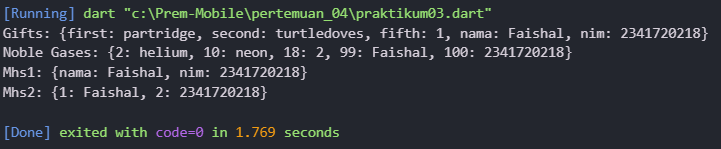

# **Laporan Praktikum Week 4**

**Identitas Mahasiswa:**

| Nama | Kelas | Absen |
|------|-------|-----|
| Faishal Harist Rahmawan | TI-3H | 10 |
 
## **Praktikum 1: Eksperimen Tipe Data List**
**Kode Program:**
~~~Dart
void main() {
  // ===== Langkah 1 =====
  var list = [1, 2, 3];
  assert(list.length == 3);
  assert(list[1] == 2);
  print("=== Langkah 1 ===");
  print(list.length); // 3
  print(list[1]);     // 2

  list[1] = 1;
  assert(list[1] == 1);
  print(list[1]);     // 1

  // ===== Langkah 3 =====
  final List<String?> listFinal = List.filled(5, null, growable: false);
  listFinal[1] = "Faishal Harist Rahmawan";
  listFinal[2] = "2341720218";

  print("\n=== Langkah 3 ===");
  print(listFinal);
}

~~~
**Output:**

**Deskripsi:** 
Langkah 1: Menunjukkan cara membuat list biasa (var list = [1, 2, 3]), membaca panjang list (length), mengambil nilai berdasarkan indeks (list[1]), dan mengubah elemen list.

Langkah 3: Menunjukkan cara membuat list dengan ukuran tetap (List.filled), dengan nilai awal null, lalu mengisi elemen tertentu. Karena tipe data String?, maka list bisa menyimpan string atau null..

## **Praktikum 2: Eksperimen Tipe Data Set**
**Kode Program:**
~~~Dart
void main() {
    var halogens = {'fluorine', 'chlorine', 'bromine', 'iodine', 'astatine'};
print(halogens);
  var names1 = <String>[];
  Set<String> names2 = {}; 
  var names3 = {}; 

  // tambah nama dan NIM ke dalam Set
  names2.add('Faishal');
  names2.addAll({'2341720218'});

  // Menampilkan hasil
  print('List: $names1');
  print('Set: $names2');
  print('Map: $names3');
}
~~~
**Output:**

**Deskripsi**
{fluorine, chlorine, ...} → Set berisi nama halogen.
var names1 = <String>[]; → List kosong ([]).
Set<String> names2 = {}; → Set kosong, lalu ditambah "Faishal" dan "2341720218".
var names3 = {}; → default-nya Map kosong ({}).

Jadi outputnya:
List: []
Set: {Faishal, 2341720218}
Map: {}
Perbedaan: List = berurutan, bisa duplikat. Set = unik, tanpa duplikat. Map = pasangan key:value.

## **Praktikum 3: Eksperimen Tipe Data Maps**
**Kode Program:**
~~~Dart
void main(){
  var gifts = {
  // Key:    Value
  'first': 'partridge',
  'second': 'turtledoves',
  'fifth': 1
};

var nobleGases = {
  2: 'helium',
  10: 'neon',
  18: 2,
};
  // Map kosong tipe Map<String, String>
  var mhs1 = Map<String, String>();
  gifts['nama'] = 'Faishal';
  gifts['nim'] = '2341720218';

  // Map kosong rtipe Map<int, String>
  var mhs2 = Map<int, String>();
  nobleGases[99] = 'Faishal';
  nobleGases[100] = '2341720218';

  // Tambahkan data ke mhs1 dan mhs2
  mhs1['nama'] = 'Faishal';
  mhs1['nim'] = '2341720218';

  mhs2[1] = 'Faishal';
  mhs2[2] = '2341720218';

  // Cetak hasil
  print('Gifts: $gifts');
  print('Noble Gases: $nobleGases');
  print('Mhs1: $mhs1');
  print('Mhs2: $mhs2');
}
~~~
**Output:**

**Deskripsi:** 
Program ini menunjukkan penggunaan Map di Dart (struktur data key–value).

- gifts awalnya berisi pasangan key–value dengan key berupa String (first, second, fifth), lalu ditambah data nama dan nim, hasilnya {first: partridge, second: turtledoves, fifth: 1, nama: Faishal, nim: 2341720218}.
- nobleGases berisi key berupa int (2, 10, 18), lalu ditambah key 99 dan 100 dengan value string, hasilnya {2: helium, 10: neon, 18: 2, 99: Faishal, 100: 2341720218}.
- mhs1 adalah Map<String, String> yang diisi nama dan nim, hasilnya {nama: Faishal, nim: 2341720218}.
- mhs2 adalah Map<int, String> yang diisi 1: Faishal dan 2: 2341720218, hasilnya {1: Faishal, 2: 2341720218}.

## **Praktikum 4: Eksperimen Tipe Data List: Spread dan Control-flow Operators**
**Kode Program:**
~~~Dart
// Langkah awal: menggunakan spread operator
void main() {
  var list = [1, 2, 3];
  var list2 = [0, ...list];
  print(list);
  print(list2);
  print(list2.length);

  // Langkah 3: menggunakan null-aware spread operator
  var list1 = [1, 2, null];
  print(list1);

  var list3 = [0, ...?list1];
  print(list3);
  print(list3.length);

  // Menambahkan NIM menggunakan spread operator
  var nimDigits = [2, 3, 4, 1, 7, 2, 0, 2, 1, 8];
  var nimList = [...nimDigits];
  print(nimList);

    // Langkah 4: menggunakan collection if
  bool promoActive = false;
  var nav = ['Home', 'Furniture', 'Plants', if (promoActive) 'Outlet'];
  print('Hasil jika promoActive false: $nav');

    promoActive = true;
  nav = ['Home', 'Furniture', 'Plants', if (promoActive) 'Outlet'];
  print('Hasil jika promoActive true: $nav');

  //lagkah 6
  var listOfInts = [1, 2, 3];
  var listOfStrings = ['#0', for (var i in listOfInts) '#$i'];
  assert(listOfStrings[1] == '#1');
  print(listOfStrings);
}
~~~

**Output:**

**Deskripsi:**
- ... (spread operator) dipakai untuk menyalin isi list ke list lain → contoh [0, ...list] hasilnya [0, 1, 2, 3].
- ...? (null-aware spread) dipakai agar penyalinan tetap aman meskipun ada null di list → hasil [0, 1, 2, null].
- Spread juga dipakai untuk menyalin list NIM → [2, 3, 4, 1, 7, 2, 0, 2, 1, 8].
- Collection if: elemen dimasukkan hanya jika kondisi benar → promoActive=false hasil [Home, Furniture, Plants], kalau true hasil [Home, Furniture, Plants, Outlet].
- Collection for: membuat elemen dari perulangan → ['#0', '#1', '#2', '#3'].

Intinya: kode ini mendemonstrasikan cara membangun list secara fleksibel dengan spread, if, dan for di Dart.

## **Praktikum 5: Eksperimen Tipe Data Records**
**Kode Program:**
~~~Dart
(int, int) tukar((int, int) record) {
  var (a, b) = record;
  return (b, a);
}

void main() {
  var record = ('first', a: 2, b: true, 'last');
  print("Langkah 1: $record");

  var angka = (10, 20);
  print("Sebelum tukar: $angka");
  print("Sesudah tukar: ${tukar(angka)}");

  (String, int) mahasiswa;
  mahasiswa = ('Faishal Harist Rahmawan', 2341720218);
  print("Data mahasiswa: $mahasiswa");

  var mahasiswa2 = ('Faishal Harist Rahmawan', a: 2341720218, b: true, 'Teknik Informatika');
  print("Posisi pertama (\$1): ${mahasiswa2.$1}");
  print("Field a (NIM): ${mahasiswa2.a}");
  print("Field b: ${mahasiswa2.b}");
  print("Posisi kedua (\$2): ${mahasiswa2.$2}");
}
~~~

**Output:**

**Deskripsi**
Program ini mendemonstrasikan records di Dart:

Fungsi tukar menerima record (int, int) lalu menukar posisi nilainya.
Contoh: input (10, 20) → output (20, 10).

Record campuran:
- var record = ('first', a: 2, b: true, 'last');
- Record bisa berisi nilai posisi ('first', 'last') dan juga field bernama (a, b).
- Record angka: (10, 20) dicetak sebelum dan sesudah dipanggil fungsi tukar.
- Record mahasiswa: (String, int) berisi nama dan NIM → ('Faishal Harist Rahmawan', 2341720218).
- Record mahasiswa2: Campuran field posisi dan field bernama → ('Faishal Harist Rahmawan', a: 2341720218, b: true, 'Teknik Informatika').
- Akses posisi pakai $1, $2, dst.
- Akses field bernama pakai .a, .b.

 Intinya: kode ini menunjukkan cara membuat, menukar, dan mengakses record (baik posisi maupun bernama) di Dart.