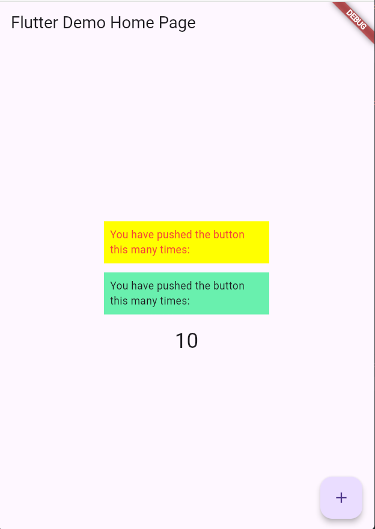

# **Laporan Praktikum Week 4**

**Identitas Mahasiswa:**

| Nama | Kelas | Absen |
|------|-------|-------|
| Faishal Harist Rahmawan | TI-3H | 10 |
 
## **Praktikum Menerapkan Plugin di Project Flutter**

**Kode Program: main.dart**
~~~Dart
import 'package:flutter/material.dart';
import 'red_text_widget.dart';

void main() {
  runApp(const MyApp());
}

class MyApp extends StatelessWidget {
  const MyApp({super.key});

  @override
  Widget build(BuildContext context) {
    return MaterialApp(
      title: 'Flutter Demo Home Page',
      theme: ThemeData(primarySwatch: Colors.blue),
      home: const MyHomePage(title: 'Flutter Demo Home Page'),
    );
  }
}

class MyHomePage extends StatefulWidget {
  const MyHomePage({super.key, required this.title});
  final String title;

  @override
  State<MyHomePage> createState() => _MyHomePageState();
}

class _MyHomePageState extends State<MyHomePage> {
  int _counter = 0;

  void _incrementCounter() => setState(() => _counter++);

  @override
  Widget build(BuildContext context) {
    return Scaffold(
      appBar: AppBar(
        title: Text(widget.title),
      ),
      body: Center(
        child: Column(
          mainAxisAlignment: MainAxisAlignment.center,
          children: <Widget>[
            // Container kuning
            Container(
              color: Colors.yellowAccent,
              width: 220,
              padding: const EdgeInsets.all(8),
              child: const RedTextWidget(
                text: 'You have pushed the button this many times:',
              ),
            ),

            const SizedBox(height: 12),

            // Container hijau
            Container(
              color: Colors.greenAccent,
              width: 220,
              padding: const EdgeInsets.all(8),
              child: const Text(
                'You have pushed the button this many times:',
              ),
            ),

            const SizedBox(height: 16),

            Text(
              '$_counter',
              style: Theme.of(context).textTheme.headlineMedium ??
                  const TextStyle(fontSize: 36),
            ),
          ],
        ),
      ),
      floatingActionButton: FloatingActionButton(
        onPressed: _incrementCounter,
        tooltip: 'Increment',
        child: const Icon(Icons.add),
      ),
    );
  }
}
~~~

**Kode Program: red_text_widget.dart**
~~~Dart
import 'package:flutter/material.dart';
import 'package:auto_size_text/auto_size_text.dart';

class RedTextWidget extends StatelessWidget {
  final String text;
  final double maxFontSize;
  final int maxLines;

  const RedTextWidget({
    Key? key,
    required this.text,
    this.maxFontSize = 14,
    this.maxLines = 2,
  }) : super(key: key);

  @override
  Widget build(BuildContext context) {
    return SizedBox(
      width: double.infinity,
      child: AutoSizeText(
        text,
        style: TextStyle(color: Colors.red, fontSize: maxFontSize),
        maxLines: maxLines,
        overflow: TextOverflow.ellipsis,
      ),
    );
  }
}
~~~

---

## **Output:**

