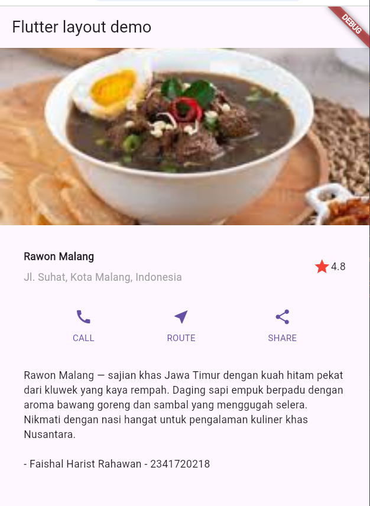

# **Laporan Praktikum Week 6**

**Identitas Mahasiswa:**

| Nama | Kelas | Absen |
|------|-------|-----|
| Faishal Harist Rahmawan | TI-3H | 10 |

## **Praktikum 1–4: Membangun Layout di Flutter**

### Implementasi Title Row
~~~Dart
import 'package:flutter/material.dart';

void main() {
  runApp(const MyApp());
}

class MyApp extends StatelessWidget {
  const MyApp({super.key});

  //  Praktikum 1–4: Membangun Layout di Flutter
  @override
  Widget build(BuildContext context) {
    //  Praktikum 1: Title Section
    Widget titleSection = Container(
      padding: const EdgeInsets.all(32),
      child: Row(
        children: [
          Expanded(
            // soal 1
            child: Column(
              crossAxisAlignment: CrossAxisAlignment.start,
              children: [
                // soal 2
                Container(
                  padding: const EdgeInsets.only(bottom: 8),
                  child: const Text(
                    'Rawon Malang',
                    style: TextStyle(fontWeight: FontWeight.bold),
                  ),
                ),
                const Text(
                  'Jl. Suhat, Kota Malang, Indonesia',
                  style: TextStyle(color: Colors.grey),
                ),
              ],
            ),
          ),
          // soal 3
          const Icon(Icons.star, color: Colors.red),
          const Text('4.8'),
        ],
      ),
    );

    //  Praktikum 2: Button Section
    Color color = Theme.of(context).primaryColor;

    Widget buttonSection = Row(
      mainAxisAlignment: MainAxisAlignment.spaceEvenly,
      children: [
        _buildButtonColumn(color, Icons.call, 'CALL'),
        _buildButtonColumn(color, Icons.near_me, 'ROUTE'),
        _buildButtonColumn(color, Icons.share, 'SHARE'),
      ],
    );

    //  Praktikum 3: Text Section
    Widget textSection = Container(
      padding: const EdgeInsets.all(32),
      child: const Text(
        'Rawon Malang — sajian khas Jawa Timur dengan kuah hitam pekat dari kluwek '
        'yang kaya rempah. Daging sapi empuk berpadu dengan aroma bawang goreng dan sambal '
        'yang menggugah selera. Nikmati dengan nasi hangat untuk pengalaman kuliner khas Nusantara.\n\n'
        '- Faishal Harist Rahawan - 2341720218',
        softWrap: true,
      ),
    );

    //  Praktikum 4: Layout Utama dengan Gambar & ListView
    return MaterialApp(
      title: 'Flutter layout: Faishal Harist Rahawan - 2341720218',
      home: Scaffold(
        appBar: AppBar(title: const Text('Flutter layout demo')),
        body: ListView(
          children: [
            Image.asset(
              'images/rawon.jpg', 
              width: 600,
              height: 240,
              fit: BoxFit.cover,
            ),
            titleSection,
            buttonSection,
            textSection,
          ],
        ),
      ),
    );
  }

  //  Method Praktikum 2: _buildButtonColumn
  static Column _buildButtonColumn(Color color, IconData icon, String label) {
    return Column(
      mainAxisSize: MainAxisSize.min,
      mainAxisAlignment: MainAxisAlignment.center,
      children: [
        Icon(icon, color: color),
        Container(
          margin: const EdgeInsets.only(top: 8),
          child: Text(
            label,
            style: TextStyle(
              fontSize: 12,
              fontWeight: FontWeight.w400,
              color: color,
            ),
          ),
        ),
      ],
    );
  }
}
~~~
### **Output Praktikum**

